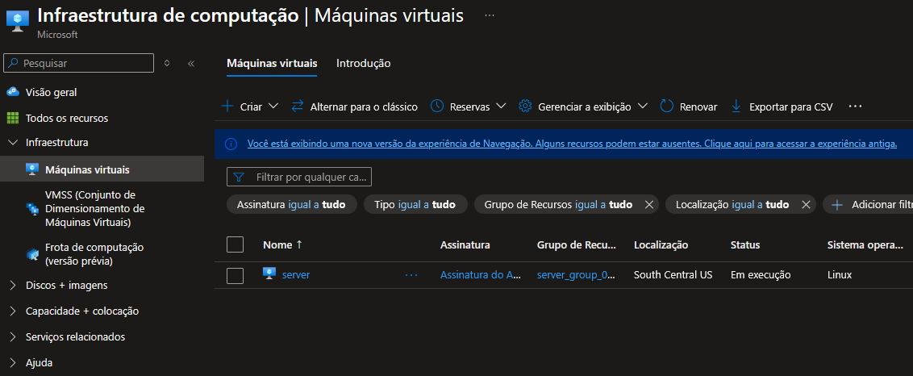
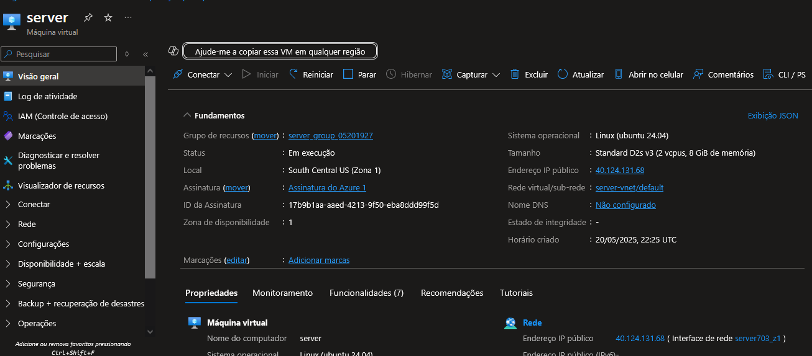

# Desafio de Projeto 2 – Criando Máquinas Virtuais no Azure

Este repositório faz parte da formação **Microsoft Azure 900 Certification** na DIO. Aqui, compartilho minha experiência com a criação e configuração de uma máquina virtual utilizando a plataforma **Microsoft Azure**, documentando os aprendizados, etapas e dicas úteis para futuras implementações.

## 🧠 Objetivo do Desafio

Praticar a criação de uma máquina virtual no Azure e desenvolver a habilidade de documentar o processo técnico de forma clara, utilizando o GitHub como repositório de estudo e referência.

## 📁 Estrutura do Repositório
desafio-de-projeto-2-criando-maquinas-virtuais/
├── README.md
└── images/
├── criacao-vm.png
└── configuracoes.png`

## 🖼️ Capturas de Tela

### Criação da Máquina Virtual

### Configurações da VM

## 🚀 O que foi feito

Durante a execução do laboratório, realizei as seguintes atividades:

- Acesso ao portal do Azure
- Criação de uma máquina virtual Windows com configurações básicas (nome, região, tamanho, usuário e senha)
- Escolha de uma imagem adequada do sistema operacional
- Configuração de portas de acesso (RDP)
- Teste de acesso remoto à VM criada

## 📄 Aprendizados

- Compreensão do processo de provisionamento de recursos no Azure
- Diferença entre regiões e suas implicações em desempenho e custos
- Como escolher o tamanho ideal da VM de acordo com a carga de trabalho
- Boas práticas na definição de nome e credenciais
- Importância do gerenciamento de portas para segurança da máquina virtual

## 💡 Dicas para quem está começando

- Use nomes descritivos para facilitar a organização dos recursos no Azure
- Atente-se à região escolhida – afeta custos e disponibilidade
- Lembre-se de **excluir a máquina virtual após os testes** para evitar cobrança
- Documente tudo o que for feito – isso facilita revisões e estudos futuros

> A pasta `/images` contém capturas de tela com as etapas principais do processo.

## 🔗 Links úteis

- [Criar uma VM do Windows no Azure – Documentação oficial](https://learn.microsoft.com/pt-br/azure/virtual-machines/windows/quick-create-portal)

---

📌 Projeto desenvolvido como parte da trilha de aprendizado "Microsoft Azure 900 Certification" na [DIO](https://www.dio.me/).

