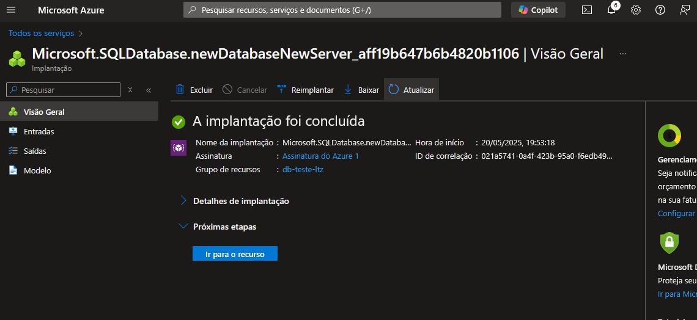
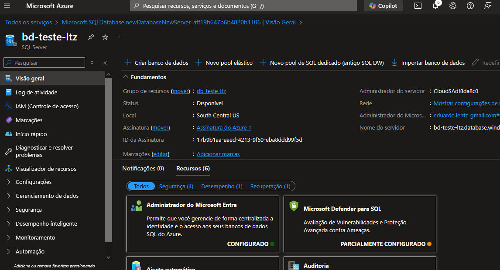

# Desafio de Projeto 3 – Configurando Banco de Dados no Azure

Este repositório faz parte da formação **Microsoft Azure 900 Certification** da DIO. Neste desafio, explorei o processo de criação e configuração de uma instância de banco de dados na plataforma **Microsoft Azure**, registrando os principais aprendizados, etapas executadas e dicas práticas para estudos futuros.

## 🧠 Objetivo do Desafio

Praticar a criação de uma instância de banco de dados no Azure, utilizando os conhecimentos adquiridos nas aulas, e documentar a experiência de forma clara e acessível no GitHub.

## 📁 Estrutura do Repositório
```
desafio-de-projeto-3-configurando-banco-de-dados/
├── README.md
└── images/
├── criacao-sql.png
└── configuracoes-banco.png

```

> A pasta `/images` pode conter capturas de tela das etapas principais da configuração.

## 🚀 O que foi feito

Durante o laboratório, realizei os seguintes passos:

- Acesso ao Portal do Azure
- Criação de uma instância de **Azure SQL Database**
- Configuração da instância: nome, região, desempenho, autenticação
- Definição de regras de firewall para permitir acesso ao banco
- Teste de conexão com uma ferramenta cliente (ex: Azure Data Studio)

## 📄 Aprendizados

- Diferença entre instância gerenciada e servidor lógico de SQL no Azure
- Importância das configurações de segurança (firewall, login, criptografia)
- Como escalar ou ajustar o desempenho da instância
- Custos relacionados ao uso de bancos no modelo PaaS
- Acesso seguro ao banco via IP autorizado

## 💡 Dicas para quem está começando

- Verifique se seu IP está autorizado no firewall antes de tentar conectar
- Escolha uma SKU (modelo de desempenho) adequada ao seu caso de uso
- Use o modo de autenticação recomendado (Azure AD ou SQL Auth)
- Documente credenciais em local seguro (nunca no repositório!)

## 🖼️ Capturas de Tela

### Criação da Instância de Banco de Dados


### Configurações da Instância SQL



## 🔗 Links úteis

- [Criar Instância Gerenciada de SQL no Azure – Documentação oficial](https://learn.microsoft.com/pt-br/azure/azure-sql/managed-instance/instance-create-quickstart)

---

📌 Projeto desenvolvido como parte da trilha "Microsoft Azure 900 Certification" na [DIO](https://www.dio.me/).
